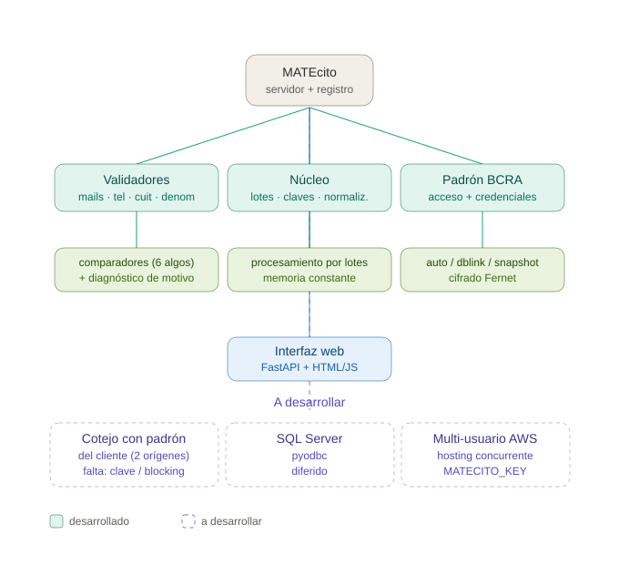

# Arquitectura de MATEcito



## La idea en una frase

MATEcito está partido en tres capas que no se conocen entre sí más de lo
necesario: **validadores** (lógica pura), **núcleo** (cómo se lee y se
escribe) y **app + procesos** (cómo se expone por HTTP). El punto de entrada
—`run.py`— es mínimo a propósito: no contiene lógica, solo levanta el servidor.

## Las capas

### validadores/ — lógica pura

Cada validador recibe un dato y devuelve un resultado. **No sabe** de dónde
vino el dato (base, archivo) ni a dónde va. Eso lo hace testeable en
aislamiento: se le pasa un valor, se comprueba la salida.

- `comparadores.py` — los 6 algoritmos de comparación de nombres + el
  diagnóstico que produce la columna MOTIVO.
- `denominaciones.py` — comparación por Jaro-Winkler con emparejado de tokens.
- `telefonos.py` — validación y desglose de teléfonos.
- `cuit.py` — validación cruzada CUIT/DNI + denominación contra el padrón.
- `cuitificador.py` — cuitificación masiva y búsqueda manual.
- `mails/agente.py` — el depurador de mails (antes `jueves.py`).

### nucleo/ — infraestructura reutilizable

Cómo se leen los datos, se agrupan en lotes y se escriben. Genérico: no sabe
qué proceso lo está usando.

- `lotes.py` — el motor de procesamiento por lotes con memoria constante y
  escritura transaccional (COUNT → INSERT → verificación → COMMIT/ROLLBACK).
- `claves_padron.py` — armado y lookup de claves CUIT/DNI contra el padrón,
  unificado (antes estaba copiado en tres jobs, con divergencias).
- `normalizador.py` — explosión de celdas multi-valor a una fila por valor.

### padron/ — acceso al padrón BCRA

- `bcra.py` — acceso en sus tres modos (auto / dblink / snapshot).
- `credenciales.py` — cifrado Fernet de las credenciales.

### app.py + procesos/ — la capa web

`app.py` pega las capas de abajo a los endpoints HTTP. `procesos/registro.py`
declara qué procesos existen; es el archivo que se edita para sumar o quitar
uno.

## Qué está desarrollado y qué no

**Desarrollado** (verde en el grafo): los seis procesos que corren hoy —
normalización, validación de mails, teléfonos, denominación, cuitificación,
búsqueda, y el nuevo módulo REDES SOCIALES · Comparación—, sobre Oracle,
MySQL y MariaDB, por base de datos y por archivo plano.

**A desarrollar** (violeta punteado en el grafo):

- **Cotejo con el padrón del cliente (dos orígenes).** Comparar una tabla de
  personas contra otra tabla o archivo, en bases posiblemente distintas.
  Bloqueado por una decisión de diseño: si hay una clave común (CUIT/DNI) se
  resuelve por índice en minutos; si no la hay, hace falta un paso de
  *blocking* o el proceso no escala (500.000 × 500.000 = inviable en tiempo).
  El módulo `comparadores.py` ya sirve para este caso; falta el orquestador.
- **SQL Server** vía `pyodbc`. Diferido; el resto del código ya lo contempla.
- **Multi-usuario en AWS.** Hosting concurrente con la clave de cifrado en
  `MATECITO_KEY` (Secrets Manager) en vez de la clave interna. El código de
  credenciales ya está preparado para el cambio sin tocar nada.

## Flujo de un proceso, de punta a punta

```
navegador → app.py (endpoint) → procesos/registro.py (¿qué necesita?)
   → nucleo/lotes.py (lee el origen por lotes)
   → validadores/*.py (compara/valida cada fila)
   → padron/bcra.py (si el proceso lo requiere)
   → nucleo/lotes.py (crea la tabla, inserta, verifica, COMMIT)
   → CSV descargable
```
